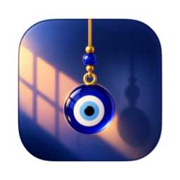
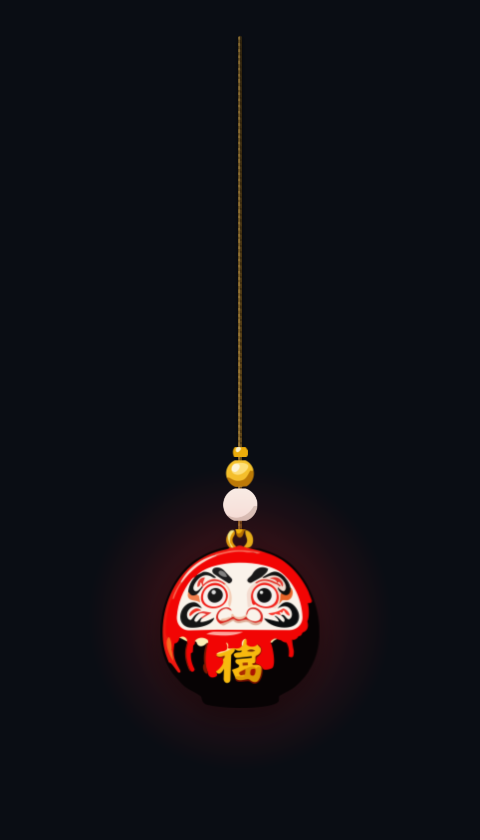

<div align="center">



# Hangly

**A tiny piece of motion for your desktop. Swings on a simulated rope.**

A physical charm hangs from your screen edge on a simulated rope. Nudge it and it swings, carries momentum, and settles — powered by real Verlet integration physics, not a looping animation.

<br>

[](#requirements)
[](https://electronjs.org)
[](https://nodejs.org)
[](LICENSE)

<br>



</div>

---

## 🌟 What is Hangly?

Hangly puts a tactile, beautiful object at the top of your screen that obeys real gravity and momentum:

- **240 Hz Verlet Physics Engine**: 20-segment rope solver with Gauss-Seidel distance-constraint relaxation, inequality stretch clamping (`maxStretchRatio = 1.02`), and rest-sleep detection.
- **17 Unique Charms**:
  - **12 Collection Charms**: Hand-crafted vector SVG charms with threaded beads (`Sunflower`, `Daruma`, `Nazar boncuğu`, `Maneki-neko`, `Hamsa`, `Nimbu-mirchi`, `Ghanta`, `Drishti bommai`, `Pánchángjié`, `Horseshoe`, `Scarab`, `Himmeli`).
  - **5 Classic Geometric Charms**: Custom rendered geometric shapes with specular bloom, radial lighting, and edge rims (`Bead`, `Camera`, `Star`, `Heart`, `Diamond`).
- **Interactive Mouse Physics**: Click, pull, toss, and flick. Momentum is calculated from release velocity and fed into the Verlet historical step.
- **Click-Through Transparent Overlay**: Empty screen space ignores clicks and passes them directly to your underlying apps and desktop. Hovering over the charm automatically engages grab interactions.
- **Zero-Latency Audio Synthesizer**: Procedural Web Audio synthesizer generating authentic material acoustics for `wood`, `glass`, `bell`, `metal`, and `soft` contacts.
- **System Tray Companion**: Right-click the system tray icon to switch charms, adjust settings, open the library, or toggle the overlay.
- **Charm Studio**: Import any custom PNG, JPEG, WebP, or SVG to create and hang your own custom charms with tailored mass, scale, and sounds.

---

## 🚀 Setup & Installation Guide (Windows)

### Prerequisites

- **Windows 10 / 11** (64-bit)
- **Node.js 18.0.0 or higher** & **npm** (Download from [nodejs.org](https://nodejs.org/))
- **Git** (Download from [git-scm.com](https://git-scm.com/))

---

### Step 1: Clone the Repository

```powershell
git clone https://github.com/Bhavanesh-stack/Hangly_v1.git
cd Hangly_v1
```

---

### Step 2: Install Dependencies

```powershell
npm install
```

---

### Option 1: Direct Double-Click (No Node.js or Terminal Required)

Hangly builds as a 100% native standalone Windows binary. You can run it directly:

1. **Single-File Portable Executable**:
   - Double-click **`dist/Hangly-Portable.exe`**.
   - A single, self-contained executable with zero dependencies — no installation, no terminal window, and no Node.js required.
2. **Desktop Shortcut**:
   - Double-click the **`Hangly`** shortcut on your Desktop.
3. **Unpacked Application Folder**:
   - Double-click **`dist/Hangly-win32-x64/Hangly.exe`**.

---

### Option 2: Running from Source (Developer Mode)

If you are modifying code and want hot-reloading:

```powershell
npm install
npm start
```

*Or double-click `Launch-Hangly.cmd` in the repository root.*

---

### Option 3: Building the Executables

To build fresh executables from source:

- **Build Single Portable `.exe` (`Hangly-Portable.exe`)**:
  ```powershell
  npm run build:portable
  ```
- **Build Unpacked Folder Distribution**:
  ```powershell
  npm run build:dir
  ```

## 🎮 How to Use

### Interacting with the Charm
- **Grab & Swing**: Click and drag the charm to pull the cord.
- **Flick & Throw**: Release while moving your mouse cursor to impart velocity into the rope.
- **Click-Through**: Normal desktop clicks pass through transparent areas without interruption.

### System Tray Menu
Right-click the Hangly tray icon in the Windows notification area to:
- **Show / Hide Overlay**: Toggle desktop visibility (`Ctrl+Shift+O`).
- **Charm Picker**: Quickly switch between all 17 charms.
- **Charm Library**: Browse charm origins, regional lore, physical weights, and acoustic profiles (`Ctrl+L`).
- **Charm Studio**: Upload and hang custom images (`Ctrl+N`).
- **Settings**: Customize screen anchor (Top-Left, Top-Center, Top-Right), scale, opacity, sound volume, and launch at Windows startup (`Ctrl+,`).
- **Quit Hangly**: Exit the companion application (`Ctrl+Q`).

---

## 🧪 Testing & Verification

Hangly includes built-in test suites to verify physics, audio, and SVG rendering:

### 1. Test Verlet Physics Engine
Validates numerical stability, distance constraints, and drag dynamics:
```powershell
npm run test:physics
```

### 2. Verify All Catalog Charms
Verifies that all 17 charm assets, SVG viewBoxes, and physical configurations are present:
```powershell
node scripts/test-all-charms.js
```

### 3. Automated Electron Rendering & Charm Switching Test
Launches a test instance in Electron, executes dynamic charm switches across SVG collection and classic charms, and verifies active pixel rendering:
```powershell
npx electron scripts/test-switch-charms.js
```

---

## 📂 Project Structure

```text
Hangly/
├── assets/
│   ├── charms/             # Hand-drawn vector SVG charms (Sunflower, Daruma, Nazar, etc.)
│   ├── icons/              # Windows application icons (.ico, .png)
│   └── CharmLibrary.json   # Regional folklore, tags, descriptions, and catalog metadata
├── src/
│   ├── main/
│   │   ├── main.js         # Electron main process & multi-window lifecycle
│   │   ├── store.js        # Persistent settings manager (%APPDATA%/Hangly/settings.json)
│   │   └── tray.js         # Windows System Tray taskbar notification integration
│   ├── renderer/
│   │   ├── overlay/        # 240 Hz Verlet rope simulation & transparent desktop overlay
│   │   ├── library/        # Charm Library catalog browser & live preview
│   │   ├── studio/         # Custom charm importer & editor
│   │   └── settings/       # Settings configuration UI
│   └── shared/
│       ├── audio/          # Procedural Web Audio sound synthesizer (wood, glass, bell, etc.)
│       ├── charms/         # Charm catalog, custom store, classic geometric renderers, & SVG splitter
│       └── physics/        # Pure JS 240 Hz Verlet rope engine, spline interpolation, & beads
├── dist/                   # Packaged Windows standalone executable (Hangly.exe)
├── scripts/                # Automated verification and build utilities
├── Launch-Hangly.cmd       # Convenient one-click Windows launcher
└── package.json            # NPM project dependencies and build scripts
```

---

## 🍎 macOS Native Build

For macOS users, the repository also includes the original Swift 6.0 / SwiftUI codebase:
1. Open `Hangly.xcodeproj` in **Xcode 16+**.
2. Select target `Hangly` and build (`Cmd+B`) or run (`Cmd+R`).
3. Requirements: macOS 14.0 (Sonoma) or later (Apple Silicon).

---

## 📄 License

This project is licensed under the [MIT License](LICENSE).
Original macOS concept & artwork by **sharancreatedthis**.
Windows port, Verlet physics engine, and architecture by **Bhavanesh-stack**.
