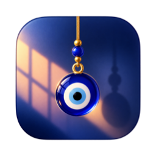

<div align="center">



# Hangly for Windows

**A tiny piece of motion for your desktop. Swings on a simulated rope.**

A physical charm hangs from your screen edge on a simulated rope. Nudge it and it swings, carries momentum, and settles — powered by real Verlet integration physics, not a looping animation.

<br>

[-blue?style=for-the-badge&logo=windows&logoColor=white)](#requirements)
[](https://electronjs.org)
[](https://nodejs.org)
[](LICENSE)

<br>


</div>

---

## 🌿 The Intention

Our screens are dominated by utilitarian rectangles, endless notification badges, and constant urgency. In optimizing our digital environments for pure productivity, we lost whimsy, tactile texture, and quiet warmth.

**Hangly was built with a singular intention: to bring a quiet piece of physical craft and tactile delight to your desktop.**

It is neither a widget that clamors for your attention nor a canned, looping animation cycling endlessly in the corner. Instead, it is a digital talisman governed by physical laws:

- **Newtonian, Not Scripted**: When you flick or drag it, a 240 Hz Verlet numerical solver computes tension, gravity, mass, and drag across a 20-segment cord. It swings with authentic momentum, reacts dynamically to release velocity, and settles naturally into stillness.
- **Respectful & Unobtrusive**: Hangly rests peacefully at the periphery of your display. With transparent click-through windowing, it never interrupts your workflow or steals clicks from underlying applications—engaging only when you intentionally interact with the charm.
- **Zero-Cost Sleep at Rest**: When the rope settles, the simulation completely sleeps. It draws 0% CPU, generates zero fan noise, and consumes no idle battery.
- **Cultural Folklore & Acoustic Soul**: Each charm is a handcrafted symbol rooted in heritage—a Turkish *Nazar* to ward off misfortune, a Japanese *Daruma* for unwavering perseverance, a radiant *Sunflower* for optimism, a protective Indian *Nimbu-mirchi*, or a welcoming *Maneki-neko*. Their contact acoustics are procedurally synthesized in real time from authentic material models (wood, bell brass, ceramic, glass, and fabric).
- **A Tactile Micro-Pause**: A gentle companion for deep work. When waiting for a build to finish, a video to export, or taking a moment to breathe and gather your thoughts, Hangly offers a grounding, satisfying physical touchstone right on your screen.

---

## 🌟 Features

Hangly puts a tactile, beautiful companion at the top of your desktop screen that obeys real gravity and momentum:

- **240 Hz Verlet Physics Engine**: 20-segment rope solver with Gauss-Seidel distance-constraint relaxation, inequality stretch clamping (`maxStretchRatio = 1.02`), and rest-sleep detection.
- **18 Unique Charms**:
  - **13 Collection Charms**: High-resolution vector SVG charms with threaded beads (`Ocean Wave 🌊`, `Sunflower`, `Daruma`, `Nazar boncuğu`, `Maneki-neko`, `Hamsa`, `Nimbu-mirchi`, `Ghanta`, `Drishti bommai`, `Pánchángjié`, `Horseshoe`, `Scarab`, `Himmeli`).
  - **5 Classic Geometric Charms**: Custom rendered geometric shapes with specular bloom, radial lighting, and edge rims (`Bead`, `Camera`, `Star`, `Heart`, `Diamond`).
- **Interactive Mouse Physics**: Click, pull, toss, and flick. Momentum is calculated from release velocity and fed into the Verlet historical step.
- **Click-Through Transparent Overlay**: Empty screen space ignores clicks and passes them directly to your underlying apps and desktop. Hovering over the charm automatically engages grab interactions.
- **Zero-Latency Audio Synthesizer**: Procedural Web Audio synthesizer generating authentic material acoustics for `wave` (ocean water swell & sea wash), `wood`, `glass`, `bell`, `metal`, and `soft` contacts.
- **System Tray Companion**: Right-click the system tray icon to switch charms, adjust settings, open the library, or toggle the overlay.
- **Charm Studio**: Import any custom PNG, JPEG, WebP, or SVG to create and hang your own custom charms with tailored mass, scale, and sounds.

---

## 📦 Installation Guide

<a id="requirements"></a>
### 💻 System Requirements

| Requirement | Minimum Specification | Recommended |
|---|---|---|
| **Operating System** | Windows 10 (64-bit, build 19041+) | Windows 11 (64-bit) |
| **Processor** | Intel Core i3 / AMD Ryzen 3 (x64) | Any modern multi-core x64 CPU |
| **Graphics** | DirectX 11 / OpenGL 2.0 compatible | Hardware-accelerated GPU |
| **RAM** | ~150 MB free memory | 300 MB free memory |
| **Storage** | 100 MB free disk space | 200 MB free disk space |

---

### ⚡ Method 1: Portable Standalone Executable (Fastest — No Install Needed)

Hangly distributes as a completely standalone, self-contained single `.exe` file. No installation wizard, no Node.js runtime, and no terminal windows are needed.

1. **Download**:
   - Download the latest **[`dist/Hangly-Portable.exe`](dist/Hangly-Portable.exe)** directly from this repository or from the [Releases](https://github.com/Bhavanesh-stack/Hangly_v1/releases) page.
2. **Place It Anywhere**:
   - Move `Hangly-Portable.exe` to your preferred folder (e.g., `Desktop`, `Documents`, or `C:\Tools\Hangly`).
3. **Run Hangly**:
   - Double-click **`Hangly-Portable.exe`**.
   - The charm will immediately appear swinging at the top edge of your screen, and the Hangly icon will appear in your Windows system tray.

> [!NOTE]
> **Windows SmartScreen Notice**:
> Because Hangly is an independent open-source project without a costly commercial Extended Validation (EV) certificate, Windows Defender SmartScreen may display:
> *"Windows protected your PC — Microsoft Defender SmartScreen prevented an unrecognized app from starting."*
> 
> Simply click **More info** → **Run anyway**. Hangly contains zero telemetry, zero trackers, and is 100% open-source with verifiable code in this repository.

---

### 🛠️ Method 2: Running from Source (Developer Mode)

If you have Node.js installed and wish to run, customize, or inspect the code directly:

1. **Prerequisites**:
   - Install [Node.js](https://nodejs.org) (v18.x, v20.x, or newer).
   - Install [Git](https://git-scm.com).

2. **Clone the Repository**:
   ```powershell
   git clone https://github.com/Bhavanesh-stack/Hangly_v1.git
   cd Hangly_v1
   ```

3. **Install Dependencies**:
   ```powershell
   npm install
   ```

4. **Launch Application**:
   ```powershell
   npm start
   ```
   *(Or double-click `Launch-Hangly.cmd` directly in the project folder).*

---

### 🔨 Method 3: Building Executables from Source

To compile and package fresh standalone Windows executables locally:

- **Build Single-File Portable `.exe` (`Hangly-Portable.exe`)**:
  ```powershell
  npm run build:portable
  ```
  *(Outputs to `dist/Hangly-Portable.exe`)*

- **Build Standard NSIS Installer (`Hangly-Setup.exe`)**:
  ```powershell
  npm run build:installer
  ```
  *(Generates a standard Windows setup wizard in `dist/`)*

- **Build Unpacked Application Directory**:
  ```powershell
  npm run build:dir
  ```
  *(Generates `dist/Hangly-win32-x64/Hangly.exe`)*

---

### 🔄 Autostart at Windows Login

To have Hangly automatically start when your computer boots:

1. Right-click the **Hangly** tray icon in your taskbar notification area.
2. Click **Settings** (or press `Ctrl+,`).
3. In the **General** tab, enable **"Launch at Windows Startup"**.
4. Settings are stored locally in `%APPDATA%\Hangly\settings.json`.

---

### 🧹 Uninstallation & Clean Removal

To completely delete the application, custom charms, autostart registry entries, and all saved settings:

#### Method A: One-Click Script (Easiest)
- Double-click **`Uninstall-Hangly.cmd`** in the repository root. It will terminate any running Hangly processes, unregister the Windows startup entry, and delete all `%APPDATA%` caches and preferences.

#### Method B: Terminal / NPM Command
```powershell
# Run the built-in uninstaller script
npm run uninstall
```

#### Method C: PowerShell One-Liner Command
```powershell
# Stop processes, remove autostart registry key, and delete all Hangly application data
Stop-Process -Name "Hangly","electron" -ErrorAction SilentlyContinue; Remove-Item -Recurse -Force "$env:APPDATA\Hangly", "$env:APPDATA\hangly" -ErrorAction SilentlyContinue; Remove-ItemProperty -Path "HKCU:\Software\Microsoft\Windows\CurrentVersion\Run" -Name "Hangly" -ErrorAction SilentlyContinue; Write-Host "Hangly completely removed."
```

#### Method D: Standard Manual Removal
- **Portable Executable**:
  1. Right-click the Hangly tray icon and click **Quit Hangly** (`Ctrl+Q`).
  2. Delete `Hangly-Portable.exe`.
  3. Delete `%APPDATA%\Hangly` and `%APPDATA%\hangly` to remove preferences and custom imported charms.
- **NSIS Installer**:
  1. Open Windows **Settings** → **Apps** → **Installed apps**.
  2. Search for **Hangly** and click **Uninstall**.

---

## 🎮 How to Use

### Interacting with the Charm
- **Grab & Swing**: Click and drag the charm to pull the cord.
- **Flick & Throw**: Release while moving your mouse cursor to impart velocity into the rope.
- **Click-Through**: Normal desktop clicks pass through transparent areas without interruption.

### System Tray Menu
Right-click the Hangly tray icon in the Windows notification area to:
- **Show / Hide Overlay**: Toggle desktop visibility (`Ctrl+Shift+O`).
- **Charm Picker**: Quickly switch between all 17 charms.
- **Charm Library**: Browse charm origins, regional lore, physical weights, and acoustic profiles (`Ctrl+L`).
- **Charm Studio**: Upload and hang custom images (`Ctrl+N`).
- **Settings**: Customize screen anchor (Top-Left, Top-Center, Top-Right), scale, opacity, sound volume, and launch at Windows startup (`Ctrl+,`).
- **Quit Hangly**: Exit the companion application (`Ctrl+Q`).

---

## 🧪 Testing & Verification

Hangly includes built-in test suites to verify physics, audio, and SVG rendering:

### 1. Test Verlet Physics Engine
Validates numerical stability, distance constraints, and drag dynamics:
```powershell
npm run test:physics
```

### 2. Verify All Catalog Charms
Verifies that all 17 charm assets, SVG viewBoxes, and physical configurations are present:
```powershell
node scripts/test-all-charms.js
```

### 3. Automated Electron Rendering & Charm Switching Test
Launches a test instance in Electron, executes dynamic charm switches across SVG collection and classic charms, and verifies active pixel rendering:
```powershell
npx electron scripts/test-switch-charms.js
```

---

## 📂 Project Structure

```text
Hangly/
├── assets/
│   ├── charms/             # Hand-drawn vector SVG charms (Sunflower, Daruma, Nazar, etc.)
│   ├── icons/              # Windows application icons (.ico, .png)
│   └── CharmLibrary.json   # Regional folklore, tags, descriptions, and catalog metadata
├── src/
│   ├── main/
│   │   ├── main.js         # Electron main process & multi-window lifecycle
│   │   ├── store.js        # Persistent settings manager (%APPDATA%/Hangly/settings.json)
│   │   └── tray.js         # Windows System Tray taskbar notification integration
│   ├── renderer/
│   │   ├── overlay/        # 240 Hz Verlet rope simulation & transparent desktop overlay
│   │   ├── library/        # Charm Library catalog browser & live preview
│   │   ├── studio/         # Custom charm importer & editor
│   │   └── settings/       # Settings configuration UI
│   └── shared/
│       ├── audio/          # Procedural Web Audio sound synthesizer (wood, glass, bell, etc.)
│       ├── charms/         # Charm catalog, custom store, classic geometric renderers, & SVG splitter
│       └── physics/        # Pure JS 240 Hz Verlet rope engine, spline interpolation, & beads
├── dist/                   # Packaged Windows standalone executables (Hangly-Portable.exe & Hangly.exe)
├── scripts/                # Automated verification and build utilities
├── Launch-Hangly.cmd       # Convenient one-click Windows launcher
└── package.json            # NPM project dependencies and build scripts
```

---

## 📄 License

This project is licensed under the [MIT License](LICENSE).
Original concept & artwork by **sharancreatedthis**.
Windows port, 240 Hz Verlet physics engine, and architecture by **Bhavanesh-stack**.
